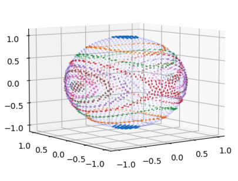

# Group-36
Code used to create the plots and investigate our project

Plots from the code in the 'Extra material' section can be found below:

scatter_ploy.py - Python scatter plot approach to finding the lines of intersection between the rigid body sphere and energy ellipsoid by producing points on both surfaces and plotting points that are sufficiently close together for increasing sizes of the energy ellipsoid
<figure>
    

rotation_diagram.py - a Python code approach to plotting the exact lines of intersection of the rigid body sphere and energy ellipsoid, not included as Mathematica code included within report gave a clearer plot
<figure>
    
